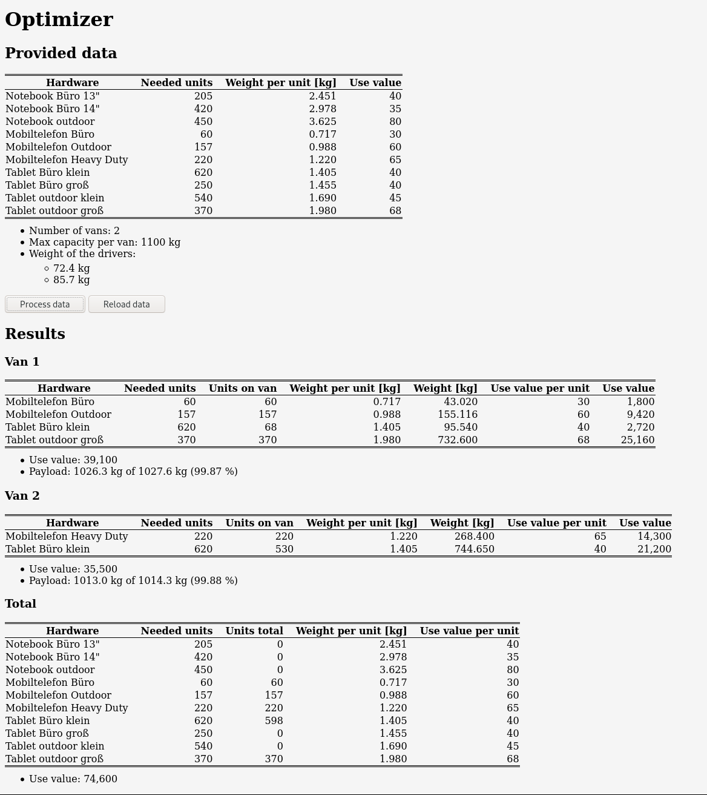

# optimizer
Calculates the distribution of goods on different vehicles based on use values using linear optimization. The constraint is the maximum payload of the vehicles.

## Lizence
This work is provided unter the terms of the MIT licence. Please take a look at the LICENSE file for the full text.

## Features
* Multiple vehicles for transportation can be defined.
* In addition to the maximum payload the weight of the drivers can be defined.
* Provide data using a csv file.
### Constraints of the algorithm
 * Payload of vehicles.
 * Maximum number of goods.

## Technologie
These software versions are known to work:
* PHP 7.4
* Apache 2.4

## Installation
* Install and configure PHP and the Webserver.
* Download the project folder by cloning it from GitHub.
* Make the project folder accessible for the web server.

## Using 
This section describes, how to use the software.

First of all, please make sure that JavaScript is activated in your web browser.
### Provide information

The data is transferred to the software via two files. Information about the goods including weight, use value and demands are written in the `data_hardware.csv` file. Ones about the maximum payload and the weight of the drivers are stored in the `data_van.php` file. Every non-integer has to be written with a dot as a decimal separator.

```
<name>;<demand>;<weight of one unit in kg>;<use value>
[…]
```

```
<?php
capacity_max = <maximum payload in kg>;
capacity_driver = array(<weight driver 1>[, <weight driver 2>[, …]]);
```

To check the provided information after changes were made you can press the *`Reload data`* button.

### Calculate optimal loading

### Sample output


## Contact
If you have any questions, just drop a message at thorres [at] brothersofgrey [dot] net.
